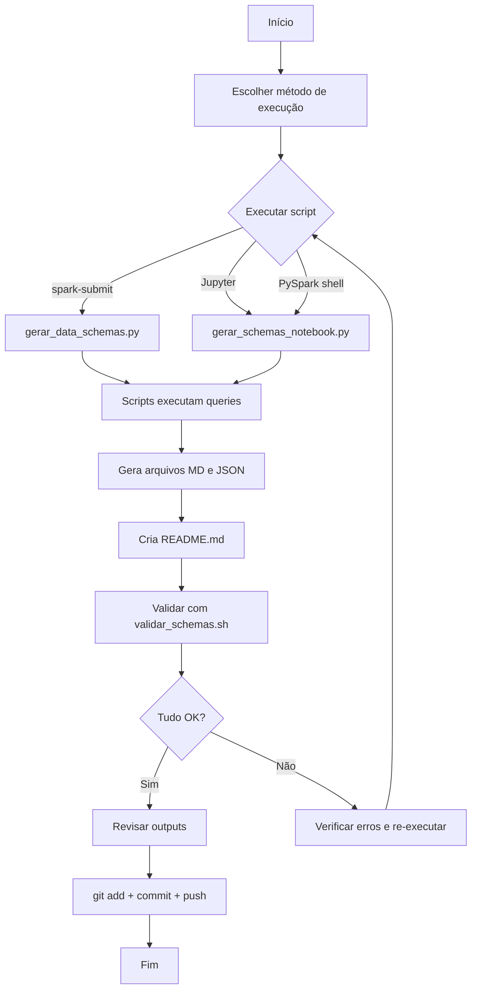

# 📚 Gerador de Data Schemas - BCadastro

Sistema automatizado para gerar documentação completa dos schemas de todas as tabelas do projeto BCadastro.

---

## 🎯 Objetivo

Gerar automaticamente para **12 tabelas**:
- ✅ `DESCRIBE FORMATTED` (estrutura completa da tabela)
- ✅ `SELECT * FROM ... LIMIT 10` (dados de exemplo)
- ✅ Documentação em Markdown
- ✅ Export em JSON

---

## 📦 Arquivos Criados

| Arquivo | Descrição | Uso |
|---------|-----------|-----|
| **`gerar_data_schemas.ipynb`** | Notebook principal completo | Abrir no Jupyter e executar todas as células |
| **`gerar_schemas_simples.ipynb`** | Notebook simplificado para uso rápido | Abrir no Jupyter e executar células |
| **`queries_exemplo.sql`** | Queries SQL individuais para teste | Copiar e colar no Impala/PySpark |
| **`validar_schemas.sh`** | Script de validação dos outputs | `./validar_schemas.sh` |
| **`INSTRUCOES_DATA_SCHEMAS.md`** | Documentação completa e detalhada | Leitura completa |
| **`GUIA_RAPIDO.md`** | Referência rápida (cheatsheet) | Consulta rápida |
| **`README_SCHEMAS.md`** | Este arquivo (índice geral) | Visão geral |

---

## ⚡ Como Usar (Quick Start)

### 1️⃣ Abra o notebook no Jupyter:

#### Método A: Notebook completo (Recomendado)
- Abra `gerar_data_schemas.ipynb` no Jupyter
- Execute todas as células em sequência
- Acompanhe o progresso com mensagens detalhadas

#### Método B: Notebook simplificado
- Abra `gerar_schemas_simples.ipynb` no Jupyter
- Execute todas as células em sequência
- Versão mais direta e rápida

### 2️⃣ Valide os resultados:
```bash
./validar_schemas.sh
```

### 3️⃣ Revise os outputs:
```bash
ls -lh data-schemas/
cat data-schemas/README.md
```

---

## 📊 Tabelas Processadas

### Tabelas Originais (6)

| # | Tabela | Tipo | Descrição |
|---|--------|------|-----------|
| 1 | `bcadastro_base_cnpj_completo` | Original | Base cadastral completa de empresas (Receita Federal) |
| 2 | `bcadastro_base_socios_consolidado` | Original | Base consolidada de sócios das empresas |
| 3 | `bcadastro_pgdas_consolidado` | Original | Declarações do PGDAS (Simples Nacional) |
| 4 | `bcadastro_tab_raiz_cpf_pai` | Original | Histórico de RBA por CPF do sócio |
| 5 | `feitoza_base_periodos_sn` | Original | Períodos de participação no Simples Nacional |
| 6 | `feitoza_rba_12_meses` | Original | Receita Bruta Acumulada dos últimos 12 meses |

### Tabelas Intermediárias (6)

| # | Tabela | Tipo | Descrição |
|---|--------|------|-----------|
| 7 | `bcadastro_output_final_acl` | Intermediária | **Output principal** - Grupos irregulares identificados |
| 8 | `feitoza_grupos_identificados` | Intermediária | Grupos econômicos identificados por vínculos |
| 9 | `feitoza_rba_grupo` | Intermediária | RBA consolidada por grupo econômico |
| 10 | `feitoza_fato_gerador` | Intermediária | Fatos geradores de exclusão do Simples Nacional |
| 11 | `feitoza_resumo_grupos_irregulares` | Intermediária | Resumo consolidado dos grupos irregulares |
| 12 | `feitoza_lista_acao_fiscal` | Intermediária | Lista priorizada de grupos para fiscalização |

---

## 📁 Estrutura de Output

```
BCadastro/
├── data-schemas/                              # Diretório gerado
│   ├── README.md                              # Índice com links para todas as tabelas
│   ├── originais/
│   │   ├── bcadastro_base_cnpj_completo.md    # Documentação Markdown
│   │   ├── bcadastro_base_cnpj_completo.json  # Dados estruturados JSON
│   │   ├── bcadastro_base_socios_consolidado.md
│   │   ├── bcadastro_base_socios_consolidado.json
│   │   ├── bcadastro_pgdas_consolidado.md
│   │   ├── bcadastro_pgdas_consolidado.json
│   │   ├── bcadastro_tab_raiz_cpf_pai.md
│   │   ├── bcadastro_tab_raiz_cpf_pai.json
│   │   ├── feitoza_base_periodos_sn.md
│   │   ├── feitoza_base_periodos_sn.json
│   │   ├── feitoza_rba_12_meses.md
│   │   └── feitoza_rba_12_meses.json
│   └── intermediarias/
│       ├── bcadastro_output_final_acl.md
│       ├── bcadastro_output_final_acl.json
│       ├── feitoza_grupos_identificados.md
│       ├── feitoza_grupos_identificados.json
│       ├── feitoza_rba_grupo.md
│       ├── feitoza_rba_grupo.json
│       ├── feitoza_fato_gerador.md
│       ├── feitoza_fato_gerador.json
│       ├── feitoza_resumo_grupos_irregulares.md
│       ├── feitoza_resumo_grupos_irregulares.json
│       ├── feitoza_lista_acao_fiscal.md
│       └── feitoza_lista_acao_fiscal.json
│
├── gerar_data_schemas.py                      # Script principal
├── gerar_schemas_notebook.py                  # Versão para Jupyter
├── queries_exemplo.sql                        # Queries individuais
├── validar_schemas.sh                         # Script de validação
├── INSTRUCOES_DATA_SCHEMAS.md                 # Documentação completa
├── GUIA_RAPIDO.md                             # Cheatsheet
└── README_SCHEMAS.md                          # Este arquivo
```

**Total de arquivos gerados:** 25
- 1 README.md (índice)
- 12 arquivos .md (documentação)
- 12 arquivos .json (dados estruturados)

---

## 📋 Conteúdo de Cada Schema

### Arquivo Markdown (.md)

Cada schema em Markdown contém:

1. **Cabeçalho**
   - Nome da tabela
   - Tipo (Original/Intermediária)
   - Database
   - Data de geração

2. **Estrutura da Tabela**
   - Lista completa de colunas
   - Tipos de dados
   - Comentários/descrições

3. **Metadados**
   - Location (caminho no HDFS)
   - Storage format
   - Serde Library
   - Input/Output formats
   - Outras propriedades técnicas

4. **Dados de Exemplo**
   - 10 primeiras linhas
   - Formato de tabela Markdown
   - Valores truncados se muito longos

5. **Queries SQL**
   - DESCRIBE FORMATTED
   - SELECT * FROM ... LIMIT 10

### Arquivo JSON (.json)

Cada schema em JSON contém:

```json
{
  "tabela": "nome_da_tabela",
  "database": "gessimples",
  "gerado_em": "2025-11-17T...",
  "describe_formatted": [
    {
      "col_name": "nome_coluna",
      "data_type": "tipo",
      "comment": "comentário"
    }
  ],
  "sample_data": [
    {
      "coluna1": "valor1",
      "coluna2": "valor2"
    }
  ]
}
```

---

## 🔧 Configuração

### Requisitos

- ✅ **PySpark** instalado
- ✅ Acesso ao **Apache Impala**
- ✅ Database: **`gessimples`**
- ✅ Permissões de **leitura** nas tabelas

### Personalização

Edite os notebooks para personalizar:

| Configuração | Notebook | Célula | Padrão |
|--------------|----------|--------|--------|
| Database | `gerar_data_schemas.ipynb` | Configuração | `gessimples` |
| Limite de linhas | `gerar_data_schemas.ipynb` | Função executar_select_sample | `LIMIT 10` |
| Diretório de output | `gerar_data_schemas.ipynb` | Configuração | `data-schemas` |
| Lista de tabelas | `gerar_data_schemas.ipynb` | Configuração | 12 tabelas |

---

## 🧪 Validação

Após executar o gerador, valide os resultados:

```bash
# Executar validação
./validar_schemas.sh

# Saída esperada:
# ✅ VALIDAÇÃO COMPLETA - Todos os data-schemas foram gerados com sucesso!
# Arquivos esperados: 25
# Arquivos encontrados: 25
```

O script de validação verifica:

- ✅ Estrutura de diretórios
- ✅ Quantidade de arquivos .md
- ✅ Quantidade de arquivos .json
- ✅ Presença do README.md
- ✅ Conteúdo não vazio
- ✅ Todas as 12 tabelas processadas

---

## 📖 Documentação

| Documento | Para quem? | Quando usar? |
|-----------|-----------|--------------|
| **README_SCHEMAS.md** (este) | Todos | Visão geral inicial |
| **GUIA_RAPIDO.md** | Usuários experientes | Consulta rápida |
| **INSTRUCOES_DATA_SCHEMAS.md** | Iniciantes | Tutorial completo |
| **queries_exemplo.sql** | Desenvolvedores | Testes manuais |

---

## 🚀 Workflow Completo



---

## ✅ Checklist de Execução

- [ ] Ambiente PySpark configurado
- [ ] Acesso ao banco `gessimples`
- [ ] Arquivos de script baixados
- [ ] Script executado: `spark-submit gerar_data_schemas.py`
- [ ] Validação OK: `./validar_schemas.sh`
- [ ] 25 arquivos gerados em `data-schemas/`
- [ ] Arquivos revisados manualmente
- [ ] Commit no git

---

## 🐛 Troubleshooting

### ❌ Erro: "Table not found"

```bash
# Verificar tabelas existentes
spark.sql("SHOW TABLES IN gessimples LIKE 'bcadastro*'").show()
spark.sql("SHOW TABLES IN gessimples LIKE 'feitoza*'").show()
```

### ❌ Erro: "Permission denied"

```bash
# Verificar permissões
spark.sql("SELECT COUNT(*) FROM gessimples.bcadastro_base_cnpj_completo").show()
```

### ❌ Arquivos não gerados

```bash
# Verificar logs
spark-submit --verbose gerar_data_schemas.py 2>&1 | tee execution.log
```

---

## 📞 Suporte

**Problemas comuns:**
- Ver seção Troubleshooting em `INSTRUCOES_DATA_SCHEMAS.md`
- Consultar `queries_exemplo.sql` para testes manuais
- Revisar notebook `BCADASTRO-Exemplo.ipynb` para exemplos

**Dúvidas sobre queries:**
- Verificar sintaxe PySpark/Impala na documentação oficial
- Testar queries individuais antes de executar o script completo

---

## 📊 Estatísticas

- **Tabelas processadas:** 12 (6 originais + 6 intermediárias)
- **Arquivos gerados por execução:** 25 (1 README + 12 MD + 12 JSON)
- **Database:** `gessimples` (Apache Impala)
- **Queries por tabela:** 2 (DESCRIBE FORMATTED + SELECT LIMIT 10)
- **Total de queries:** 24

---

## 🎯 Próximos Passos

1. **Executar o gerador**
   ```bash
   spark-submit gerar_data_schemas.py
   ```

2. **Validar resultados**
   ```bash
   ./validar_schemas.sh
   ```

3. **Revisar documentação gerada**
   ```bash
   cat data-schemas/README.md
   cat data-schemas/originais/bcadastro_base_cnpj_completo.md
   ```

4. **Commit no repositório**
   ```bash
   git add data-schemas/
   git commit -m "docs: adiciona data-schemas de todas as tabelas"
   git push
   ```

---

**Versão:** 1.0
**Data:** 2025-11-17
**Autor:** Sistema automatizado BCadastro
**Database:** gessimples (Apache Impala)
